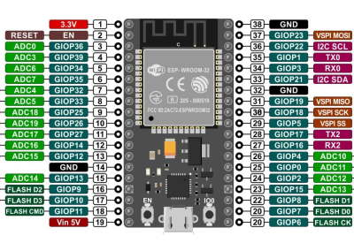

This repo is for myself and others who want to start programming their ESP32-WROOM-32 SBC.
Specifically I bought ESP32 WROOM 32 DEVKIT C with 19 pins on either side.
I'm on a MAC so some points might be different for those on Linux etc.

## Setting up Arduino IDE to connect to ESP32 (on MAC)
1) DL the Arduino IDE to program and flash your ESP32 board.
- IDE https://www.arduino.cc/en/software

2) Under Additional Boards Manager URLs paste 
- https://raw.githubusercontent.com/espressif/arduino-esp32/gh-pages/package_esp32_index.json
This will give you under Tools/Manage Libraries the ESP32 to install.
Read more at: https://github.com/espressif/arduino-esp32
3) Under boards I used the "ESP 32 Dev Module" generic choice

For the USB from MAC to ESP32 to work I needed the correct driver:
- https://www.silabs.com/developers/usb-to-uart-bridge-vcp-drivers

Above steps 1&2&3 are described well in eg this video: https://xit.fi/install-arduino-ide-esp32stuff



## Testing Wifi with easy SimpleTime.ino program
On the Arduino IDE you can find the SimpleTime.ino sketch (or from within this repo) that connects to your local Wifi network and prints local time to the serial monitor. This simple sketch is easy enough to use.

If your changes after the initial flashing do not go through without error, try to unplug the USB, that helped for me.

```(Serial port /dev/cu.SLAB_USBtoUART
  File "esptool.py", line 3969, in <module>
  File "esptool.py", line 3962, in _main
  File "esptool.py", line 3551, in main
  File "esptool.py", line 271, in __init__
  File "serial/__init__.py", line 88, in serial_for_url
  File "serial/serialposix.py", line 268, in open
serial.serialutil.SerialException: [Errno 16] could not open port /dev/cu.SLAB_USBtoUART: [Errno 16] Resource busy: '/dev/cu.SLAB_USBtoUART'
Failed to execute script esptool
An error occurred while uploading the sketch)```

That's it! Have fun with your ESP32.

